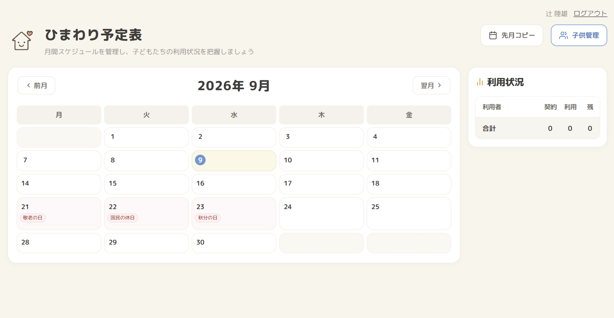

# ひまわり予定表

**本番環境**: https://schedule-app.org

## 主な機能

- 月間カレンダーで子どもの出席を管理（平日のみ表示）
- 出席ごとに 午前/午後・送り・迎えを設定
- 1日の上限人数（10人）をサーバー側で保証
- 子どもの追加・削除・色分け・契約日数の設定・ドラッグ&ドロップ並び替え
- 先月の予定を「第n◯曜日」で今月にコピー（祝日は自動でスキップ）
- 契約日数に対する利用状況の集計（残日数がマイナスなら赤字）
- 日本の祝日を外部APIから取得して表示
- Googleアカウント認証 + 管理者による利用承認

## 技術構成

| | |
|---|---|
| フロント | Next.js 16 (App Router) / React 19 / TypeScript / Tailwind CSS v4 |
| 状態管理 | TanStack Query v5（サーバー状態） / Zustand（UI状態） |
| フォーム | React Hook Form + Zod |
| DB | MySQL 8.0 / Prisma 7（driver adapter 経由） |
| 認証 | Auth.js v5（Google OAuth・DBセッション） |
| CI/CD | GitHub Actions |
| テスト | Vitest |
| インフラ | AWS EC2 (Ubuntu 24.04) / nginx / systemd / Let's Encrypt |